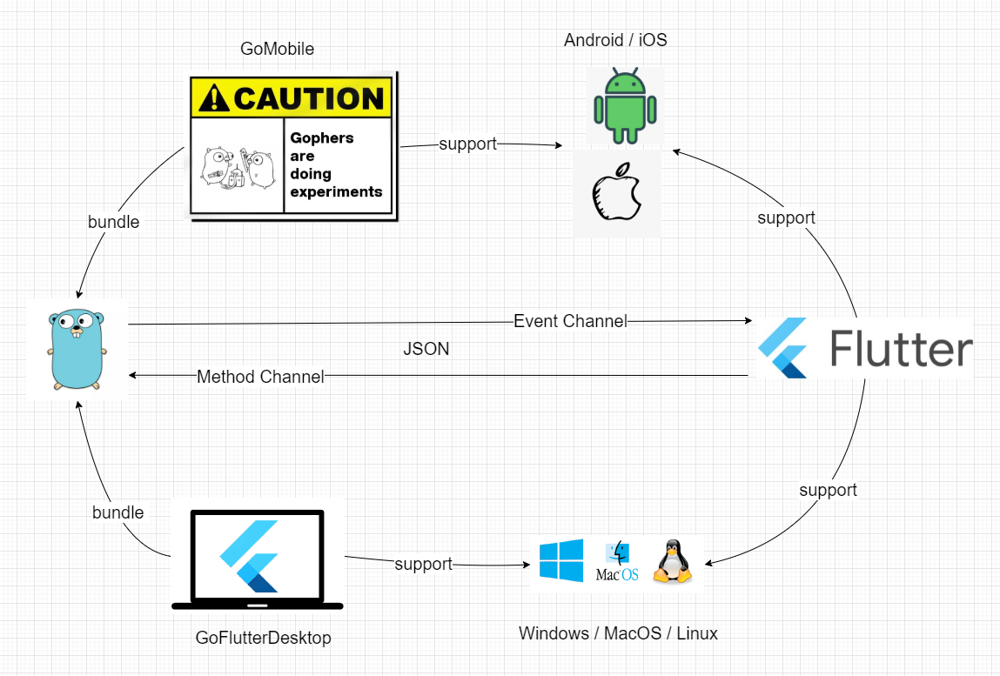

# NHENTAI-CROSS

## 简体中文 | [English](README-en.md)

[](https://raw.githubusercontent.com/niuhuan/pikapika/master/LICENSE)
[](https://github.com/niuhuan/pikapika/releases)
[](https://github.com/niuhuan/pikapika/releases)

一个美观且跨平台的*NHentai客户端*，支持桌面端与移动端(Mac/Windows/Linux/Android/IOS)。

内置DNS拦截器，可以让部分国家和地区免代理使用网络加速，请您在遵守当地法律的情况下使用。

如果您觉得此软件对您有帮助，可以star进行支持。同时欢迎您issue，一起让软件变得更好。

仓库地址 [https://github.com/niuhuan/nhentai-cross](https://github.com/niuhuan/nhentai-cross)

## 软件截图

#### 漫画列表


#### 漫画详情


#### 漫画阅读器


## 构建

- 项目结构
  

- 手机端
  ```shell
  # 参考 go/mobile/*.sh
  # 1. 将go代码编译成手机端使用的类库
  gomobile bind -target=$target -o $libraryLocal $project/go/mobile
  # 2. flutter build
  lutter build $system-package
  ```

- 桌面端
  ```shell
  hover run
  ```
